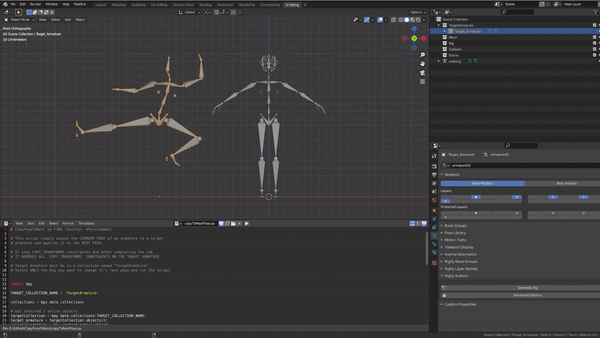

## CopyToRestPose

This script simply copies the **current pose** of an armature to a target 
armature and applies it as the REST POSE. 

It uses **COPY_TRANSFORMS** constraint and after completing the job
It REMOVES all of the **COPY_TRANSFORMS** constraints on the target armature. 

- Simply install the .py file by using the addon panel in Blender.

- Place the target armature into collection named **"TargetArmature"**

- Select ONLY the Rig you want to change it's rest pose and run the script
or call the operator named "CopyPose to RestPose"

twitter: @ferotanman
